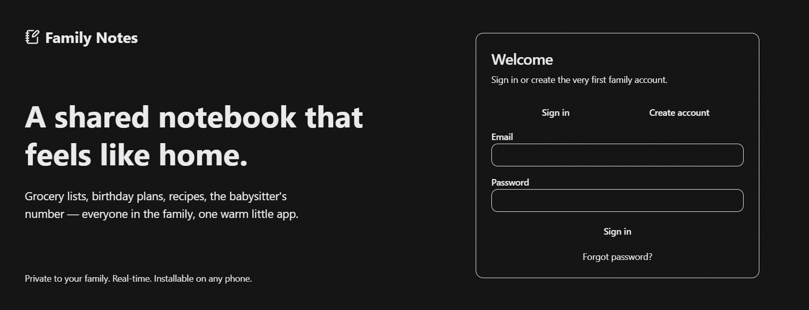
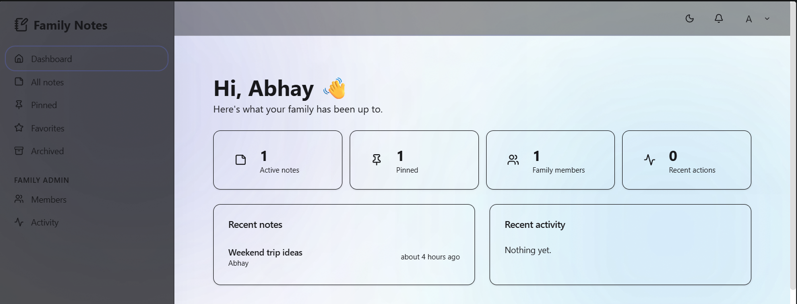
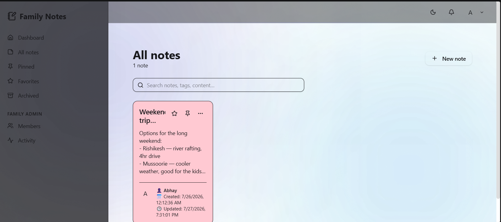
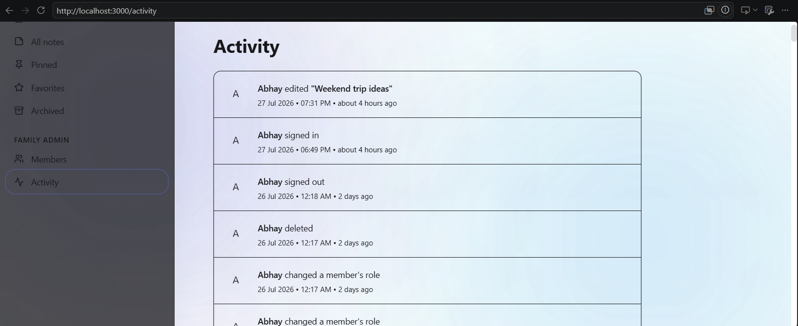

# 📝 Family Notes

A secure real-time collaboration platform that allows families and small businesses to share notes, organize information, and stay connected through a single workspace.

---

## 📸 Screenshots

### Login Page



### Dashboard



### Notes



### Members


### Activity Log



---

# ✨ Features

- 🔐 Secure Authentication using Supabase
- 👨‍👩‍👧 Family & Team Collaboration
- 📝 Create, Edit & Delete Notes
- 📊 Activity Logs
- 🔒 Role-Based Access Control
- 🔄 Real-Time Database
- 📱 Responsive Design
- 🔑 Password Reset
- ⚡ Fast UI with Vite

---

# 🛠 Tech Stack

## Frontend

- React 19
- TypeScript
- Vite
- TanStack Router
- TanStack Query
- Tailwind CSS
- shadcn/ui
- Framer Motion

## Backend

- Supabase
- PostgreSQL
- Supabase Edge Functions

## Authentication

- Supabase Auth

## Validation

- Zod

---

# 📚 What I Learned

This project helped me gain practical experience with:

- Building scalable React applications
- TypeScript development
- TanStack Router
- TanStack Query
- Supabase Authentication
- PostgreSQL
- CRUD Operations
- Role-Based Access Control
- Protected Routes
- Form Validation
- Environment Variables
- Git & GitHub Workflow
- Deploying Edge Functions
- Building reusable UI components

---

# 🚀 Challenges I Solved

- Integrated Supabase Authentication
- Created protected routes
- Implemented role-based authorization
- Built reusable React components
- Configured Supabase Edge Functions
- Added activity logging
- Removed Lovable-specific dependencies and made the project framework-independent
- Managed secure environment variables
- Implemented password reset flow

---

# 📂 Folder Structure

```text
src/
 ├── components/
 ├── hooks/
 ├── integrations/
 ├── lib/
 ├── routes/
 └── styles/

supabase/
 ├── functions/
 └── config.toml
```

---

# ⚙️ Installation

Clone the repository

```bash
git clone https://github.com/abhay7as/Family-Notes.git
```

Navigate to the project

```bash
cd Family-Notes
```

Install dependencies

```bash
npm install
```

Create a `.env` file from `.env.example`

```bash
cp .env.example .env
```

Add your Supabase credentials

```env
VITE_SUPABASE_URL=YOUR_SUPABASE_URL
VITE_SUPABASE_PUBLISHABLE_KEY=YOUR_SUPABASE_PUBLISHABLE_KEY
```

Start the development server

```bash
npm run dev
```

---

# 📦 Build

```bash
npm run build
```

---

# 🔮 Future Improvements

- File Upload Support
- Push Notifications
- Calendar Integration
- Categories & Tags
- Offline Mode
- Family Invitations
- Advanced Search
- AI-powered Note Summaries

---

# 👨‍💻 Author

**Abhay Dangwal**

GitHub: https://github.com/abhay7as

---

⭐ If you found this project interesting, consider starring the repository!